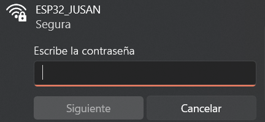
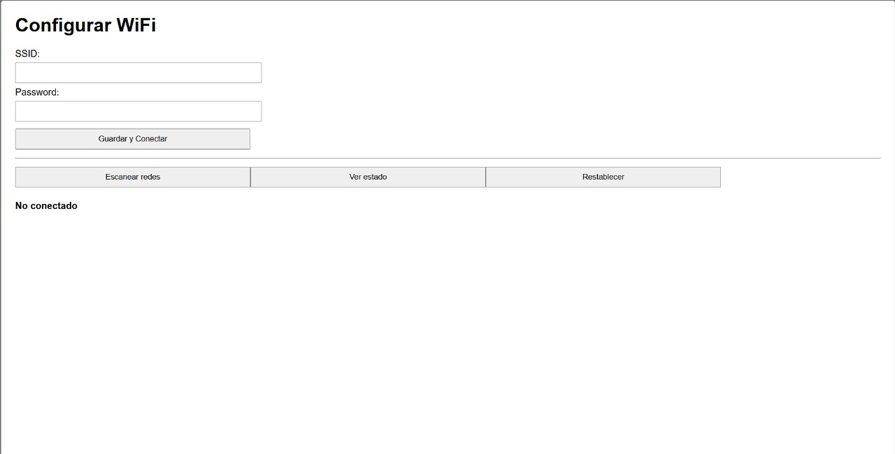
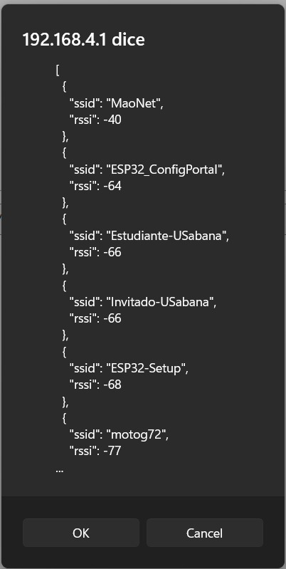
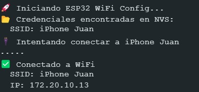
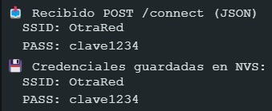
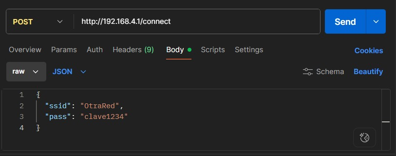

#  Proyecto IoT: Aprovisionamiento WiFi con ESP32

Este proyecto implementa una solución **IoT** basada en el microcontrolador **ESP32** que permite la configuración dinámica de la red WiFi sin necesidad de reprogramar el dispositivo.  
El sistema emplea un **portal cautivo** (interfaz web local) para que el usuario final ingrese el **SSID** y la **contraseña** de su red WiFi. Las credenciales se guardan en memoria no volátil y el dispositivo se reconecta automáticamente en posteriores reinicios.  

---

##  Abstract
En este proyecto se diseña e implementa un mecanismo de **aprovisionamiento de red WiFi** para dispositivos IoT basados en ESP32. El sistema inicia en modo AP si no hay credenciales almacenadas, ofreciendo un portal cautivo local para que el usuario configure la red. Posteriormente, guarda la información en memoria no volátil y reconecta automáticamente.  
El diseño contempla **buenas prácticas de ingeniería**, documentación bajo estándar **IEEE**, validación funcional y pruebas mediante **Postman**.  

**Palabras clave:** IoT, ESP32, WiFi Provisioning, Arduino, Ingeniería IEEE.

---

##  Requisitos del sistema

- Microcontrolador **ESP32**
- Entorno de desarrollo **Arduino IDE**
- Librerías: `WiFi.h`, `WebServer.h`, `Preferences.h`
- Conexión serial para monitoreo
- Navegador web para acceder al portal cautivo

---

##  Funcionalidades principales

- ✅ Inicio en **modo AP** si no existen credenciales guardadas  
- ✅ Interfaz web (portal cautivo) para ingresar SSID y contraseña  
- ✅ **Almacenamiento persistente** en memoria no volátil (Preferences)  
- ✅ Reconexión automática a la red configurada  
- ✅ **Botón físico** para restablecer configuración (factory reset)  
- ✅ Documentación técnica (IEEE) + Diagramas UML  
- ✅ **API REST** con endpoints documentados  
- ✅ **Colección Postman** incluida para pruebas

---

##  Instrucciones de uso

1. Subir el código al ESP32 desde Arduino IDE.  
2. Encender el dispositivo:  
   - Si no tiene credenciales → inicia AP `ESP32_Config` (pass: `12345678`).  
   - Si ya tiene credenciales → intenta conectar en modo STA automáticamente.  
3. Conectarse al AP y abrir en navegador: **http://192.168.4.1**  
4. Ingresar SSID y contraseña de la red WiFi.  
5. El ESP32 intentará conectarse y mostrará el resultado en Serial y vía API `/api/status`.  

---

## Endpoints implementados

| Método | URL                  | Descripción                                      | Body (JSON)                         | Respuesta (ejemplo) |
|--------|----------------------|--------------------------------------------------|-------------------------------------|----------------------|
| `POST` | `/api/provision`     | Configura nuevas credenciales WiFi               | `{ "ssid":"MiRed", "password":"1234" }` | `{ "status":"ok" }` |
| `GET`  | `/api/status`        | Consulta estado de conexión                      | —                                   | `{ "mode":"STA", "status":"CONNECTED", "ip":"192.168.1.42" }` |
| `POST` | `/api/reset`         | Restablece configuración (borra credenciales)    | —                                   | `{ "status":"reset" }` |

---

##  Diagramas del sistema

- **Diagrama de secuencia (UML)**  
  

---

##  Prueba de uso

1. Iniciamos la esp32 conectandola una toma o Computador
2. Nos conectamos a la red desde un computador usando las credenciales dadas en el codigo
   
 

3. Al conectamos ingresamos a la web que inicia la esp32 mediante el puerto 80 en este caso la ip es 192.168.4.1
   
 HTTP://192.168.4.1

4. Al desplegarlo nos aparece un menu donde debemos dar las credenciales de la red a la que queramos conectar (Podemos hacer escaneo de las redes disponibles)
   
 

 

5. Cuando nosotros mandamos a conectar al wifi que querramos (en el serial de la esp32 nos dira si el status es correcto y esta conectado)

 

6. Hacemos una preuba con get mediante postman
   
 
 
 

 7. Hacemos una preuba con post mediante postman

 
 

- Codigo: El codigo se encuentra en la raiz de este repositorio.

---

##  Referencias

[1] Espressif Systems, *ESP32 Wi-Fi Programming Guide*, 2023.  
[2] Arduino, *WiFi Library for ESP32 Documentation*, 2024.  
[3] IEEE, *Standards for Documentation of Embedded Systems*, 2020.  

---

## 👤 Autores

- **Juan David Heano Osorio** – Universidad De la sabana 
- **Santiago Bazzani Rincon** – Universidad De la sabana

